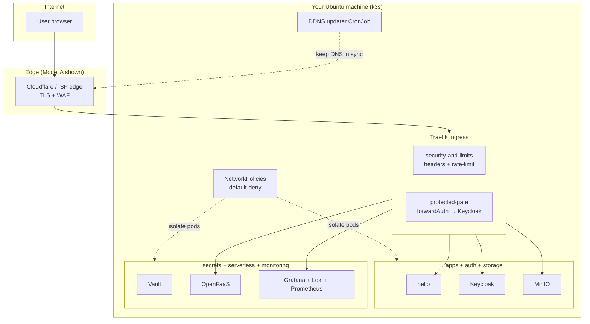
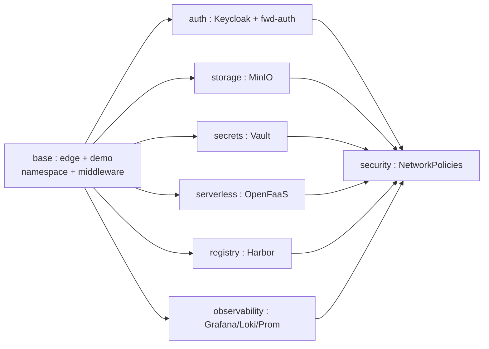
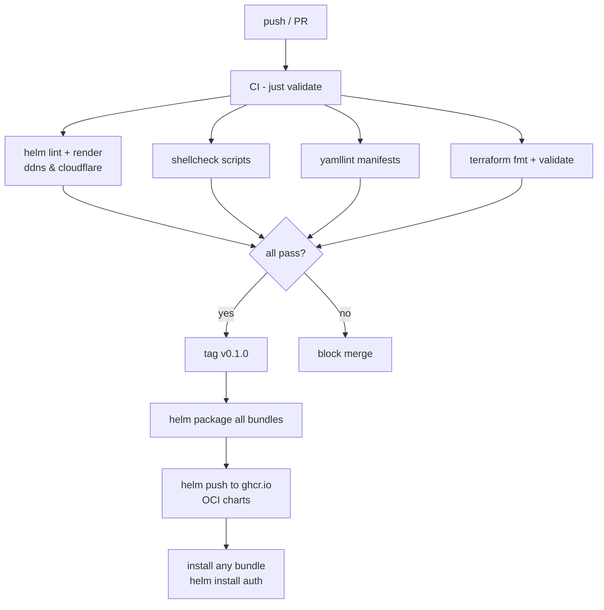
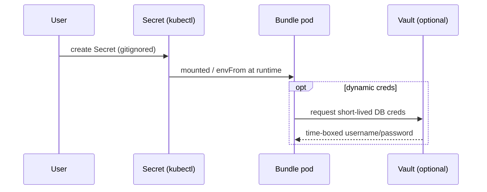

# 🏛️ 03 — Architecture Diagrams

Mermaid diagrams for the cluster, the bundle composition model, and the
pipeline. Rendered versions are in [`assets/`](assets/); the Mermaid source
below each is what to edit.

> Rendered: [architecture.png](assets/architecture.png) ·
> [bundles.png](assets/bundles.png) · [pipeline.png](assets/pipeline.png)

---

## 1. Logical architecture (with `base` + optional bundles)

## 2. Bundle composition ("choose what you want")

> `security` is a cross-cutting layer (dashed edges show what it hardens).
> `base` is the prerequisite for everything else. All others are independent
> opt-ins.

## 3. The validation & release pipeline

---

## 4. Secrets flow (nothing plaintext)

---

► **[Next: Accuracy pipeline & release](04-pipeline.md)** |
◄ [Back to 09 — Bundles](README.md)
