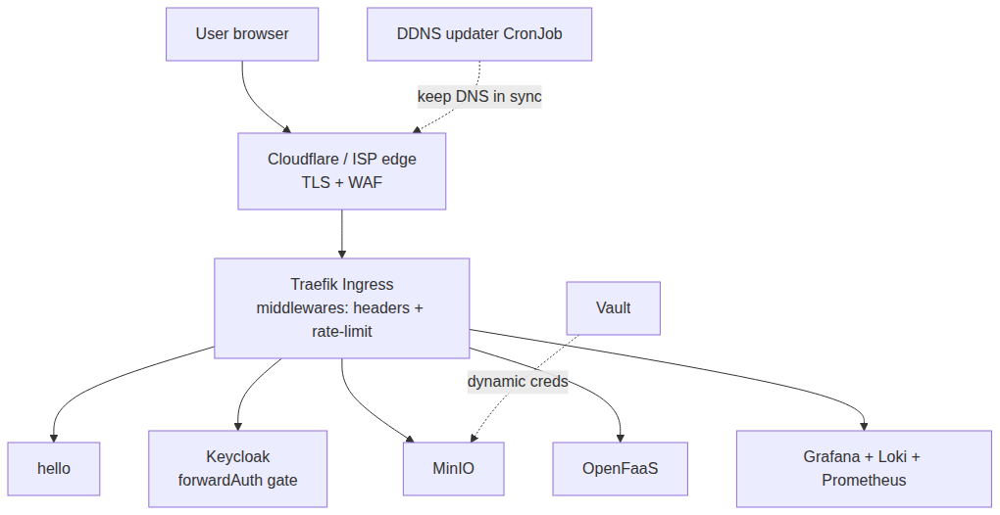

# 🧩 09 — Bundles & Release

> **This is the "product" on top of the guides: composable, packagable bundles
> you install by *choosing*, not by reading.** A bundle is a small self-contained
> Helm chart (namespaces, routing, middleware, wiring values) published to an OCI
> registry, so anyone can `helm install` just what they want.

## 📖 What's in this section

| # | Document | Covers |
|---|----------|--------|
| [01](01-bundles.md) | The bundle catalog & how to choose | what each bundle gives you, AWS mapping |
| [02](02-networking-models.md) | Two network topologies | **$0 DDNS** vs **Cloudflare Tunnel** |
| [03](03-architecture.md) | Architecture | Mermaid diagrams + rendered PNGs |
| [04](04-pipeline.md) | Accuracy pipeline & release | CI validation + OCI publishing |

---

## The core idea

```
        this repo = desired state + packaging system
                        │
     ┌──────────────────┼──────────────────────┐
     │                  ▼                      │
   bundles/          scripts/ + justfile    .github/workflows/
   8 charts +     +  validate.sh           (CI + OCI release)
   aggregator    +  apply.sh / package.sh
     │                  │                      │
     └──────────►  CI validates (helm+tf+sh)   │
                            │                  │
                     packages + publishes ────┘
                            ▼
        choose what you want → just deploy base auth storage
```

- **Accuracy** — nothing ships unless `just validate` passes: helm lint +
  render, shellcheck, yamllint, terraform fmt/validate.
- **Packaging** — every bundle `helm package`s and pushes to `ghcr.io` on a
  version tag.
- **Choice** — the `home-cloud` aggregator enables exactly the bundles you
  want; the standalone charts let you install one (e.g. just `auth`).

## Quick start (from this repo)

```bash
# your cluster is up and you can reach it with kubectl — then just pick:
just deploy base auth storage          # the ones you want

# a single bundle from a released package (no git, no docs):
helm install auth oci://ghcr.io/Franck-Sorel/home-cloud-auth --version 0.1.0
```

> Multiple bundles are passed quoted to `just` because variadic args are
> unavailable in this `just` build: `just deploy "base auth storage"`.

---

## Rendered architecture



Take it from there — **[01 — the bundle catalog](01-bundles.md)**.

---

## 🧭 Navigation

- [🏠 Repository home](../../README.md)
- [🧩 09 — Bundles (you are here)](README.md)

◄ **[Back to repository home](../../README.md)**
