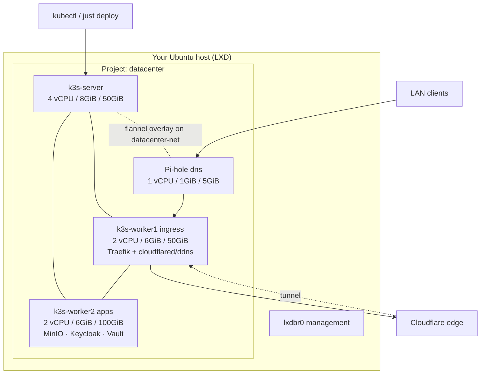

# 🏗️ 03 — Architecture (target topology)

> **Who this is for:** the designer who needs the concrete layout — project,
> instances, networking, storage, and how the existing `base` bundle's
> ddns/cloudflare networking maps onto a multi-node cluster.

This document is the "what": the map. "How to build it" is
[04 — Implementation](04-implementation.md); "how to run it day-to-day" is
[05 — Ops workflow](05-ops-workflow.md).

---

## 1. The big picture

One Ubuntu host runs LXD. Inside LXD there is one **project** called
`datacenter` that owns four instances joined into **one k3s cluster** plus a
DNS box. A project is LXD's isolation + naming boundary: `datacenter/*` is the
whole unit, which is what makes `lxc stop datacenter/*` one command.

| Instance | Role | k3s role | Resources (caps) | Notes |
|----------|------|----------|------------------|-------|
| `k3s-server` | Control plane | server `--disable=traefik` | 4 vCPU · 8 GiB · 50 GiB | holds etcd/control-plane; also a traefik host for tests |
| `k3s-worker1` | Gateway / ingress | worker | 2 vCPU · 6 GiB · 50 GiB | runs **Traefik** ingress (tolerate taint), cloudflared, ddns-updater |
| `k3s-worker2` | Data / apps | worker | 2 vCPU · 6 GiB · 100 GiB | runs MinIO, Keycloak, Vault, apps — big disk |
| `dns` | LAN DNS | *(not k3s)* | 1 vCPU · 1 GiB · 5 GiB | Pi-hole-style resolver, bound to the LAN |

> The DNS box is deliberately **outside** k3s — DNS is infra, not an app: if
> the cluster is down you still want resolution. (Alternative: run AdGuard
> Home *as a k3s pod* and accept DNS depends on the cluster.)

---

## 2. Networking & storage design (isolation)

### Networks (LXD managed bridges)

| Network | CIDR | Used by | Purpose |
|---------|------|---------|---------|
| `datacenter-net` (managed bridge, isolated) | `10.10.0.0/24` | all four instances | cluster-internal traffic (k3s, flannel overlay, DNS) |
| `lxdbr0` (default bridge) | `10.x.x.x/24` | host ↔ instances | management / SSH / outbound DHCP access |

Why two networks: **`datacenter-net` is the datacenter's private fabric** and
`lxdbr0` is the management lane. Keep them separate so inter-node traffic
doesn't leak into the host LAN, and only the instances that must reach the
internet (traefik/cloudflared) get routed out.

```
                        ┌──── HOST LAN ────┐
                        │  router/ISP DHCP │
                        └────────┬─────────┘
                                 │ lxdbr0 (management, outbound)
        ┌────────────────────────┼─────────────────────────┐
        │   LXD : project datacenter                        │
        │   ┌────────────────────────────────── datacenter-net (10.10.0.0/24)
        │   │  10.10.0.1 server · .2 worker1 · .3 worker2 · .4 dns
        │   │
        │   │   k3s overlay (flannel) rides on top of datacenter-net
        │   └───────────────────────────────────────────────┘
        └──────────────────────────────────────────────────────┘
```

### Storage pool

One LXD storage pool (`datacenter-pool`, e.g. `dir` on the host disk, or
`zfs`/`btrfs` if you're on a trimmed setup). Each instance's root gets
`--disk=` from the profile. Snapshots live on the same pool — see
[05 — Ops](05-ops-workflow.md) for the backup recipe.

> Isolate by **disk cap** (per-instance `limits.disk`), not by separate pools.
> One pool is simpler to snapshot/restore; give `worker2` the big cap because
> it hosts the data-heavy pods.

---

## 3. How the k3s cluster forms

```
  k3s-server               workers
  ┌──────────┐    token    ┌──────────┐
  │  api/etcd │◄───────────│ worker1  │
  │  :6443    │   join     ├──────────┤
  └──────────┘             │ worker2  │
                           └──────────┘
     1) k3s server --tls-san=<ip>        (creates /var/lib/rancher/k3s/server/node-token)
     2) workers: k3s agent --server https://10.10.0.1:6443 --token <node-token>
     3) export KUBECONFIG=/etc/rancher/k3s/k3s.yaml  → kubectl get nodes (3 ready)
```

The **server** registers first and emits a `node-token`; each **worker**
joins with:
`k3s agent --server https://<server-ip>:6443 --token <token> --node-ip <own-ip>`.

---

## 4. Where Pi-hole sits (LAN DNS)

The `dns` instance runs Pi-hole (or AdGuard Home) and is attached to both
`lxdbr0` (to be reachable from the LAN) and `datacenter-net` (to resolve the
cluster's internal names). On the host LAN, set your router's DHCP to hand the
Pi-hole IP to clients:

```
LAN client ──► dns (Pi-hole: 10.10.0.4 via lxdbr0) ──► upstream (1.1.1.1 / 9.9.9.9)
                  │                                     (blocklist sinkhole)
                  └── resolves hello.homelab.lan ──► k3s ingress (10.10.0.2)
```

This maps cleanly onto the repo's "cheap private-LAN bonus" idea in
[`docs/09-bundles/02-networking-models.md`](../../docs/09-bundles/02-networking-models.md):
the DNS box is that AdGuard/Technitium baseline, but here it's a **dedicated
instance**, so ad-blocking + local names survive even when the cluster stops.

---

## 5. How `base`'s ddns / cloudflare networking maps onto multi-node

The `base` bundle assumes one endpoint that owns Traefik + the tunneling side.
In this topology the **gateway/Traefik runs on k3s** (on `worker1`), **not on
LXD** — LXD is only the fabric that hosts the nodes. The mapping:

| `base` concept | In the old single-node story | In this multi-node topology |
|----------------|------------------------------|-----------------------------|
| **Traefik ingress** | ran on the one node | one Deployment, pinned to `worker1` (nodeSelector + taint tolerance) |
| **Model A — ddns** (`ddns-updater` CronJob) | kept public DNS ⇄ IP in sync | stays a **k3s CronJob**; it may live on `worker2`, same job, same result |
| **Model B — cloudflare** (`cloudflared` Deployment) | opened outbound tunnel from k3s | stays a **k3s Deployment** on the ingress worker, opening the single outbound tunnel |
| **Wildcard TLS** (LEGO DNS-01) | requested by Traefik | unchanged — Traefik still does DNS-01 against deSEC/Dynu/Cloudflare from inside the cluster |
| **Public exposure** | inbound 80/443 or tunnel | unchanged — whichever `mode:` you picked in `base` |

**Pause / the mental model:** virtualization is *under* everything the repo
already built. The bundle layer (`just deploy base auth storage`) still targets
a kubeconfig — it just points at `https://10.10.0.1:6443` instead of
`https://127.0.0.1:6443`, and the cluster it lands on is now genuinely
multi-node.

---

## 6. Topology diagram (Mermaid)



Rendered intuition: `kubectl get nodes` returns `k3s-server`, `worker1`,
`worker2` — three real machines, one command to stop them all
([walk-through: 04 — Implementation](04-implementation.md)).

---

## 🧭 Navigation

► **[Next: 04 — Implementation](04-implementation.md)**

◄ **[Back: 02 — Recommendation](02-recommendation.md)** · [Back: 02 Virtualization Layer](README.md)
